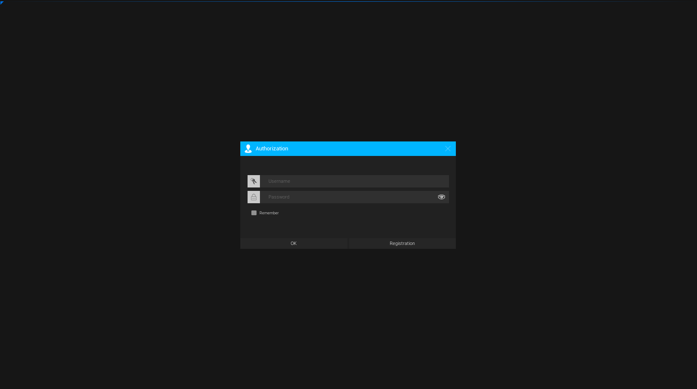
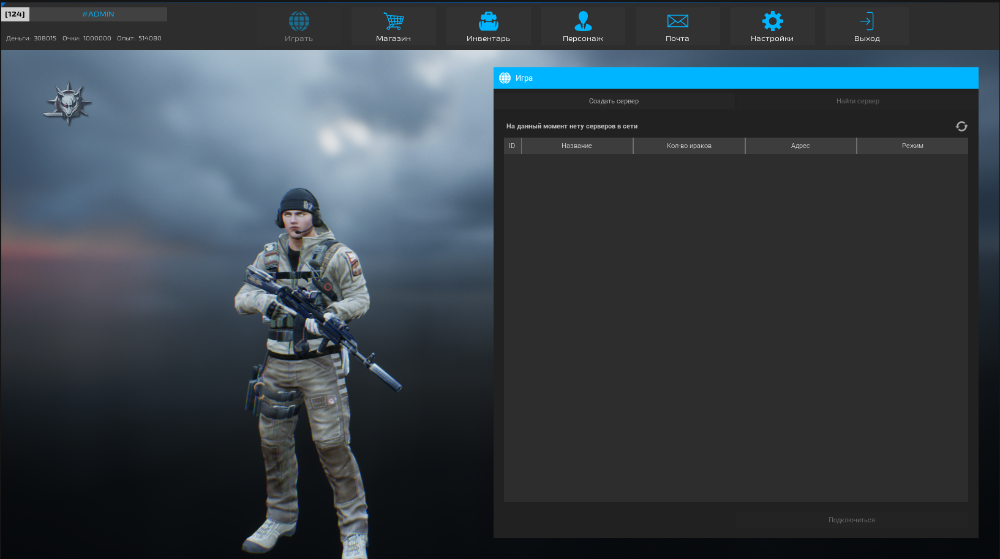
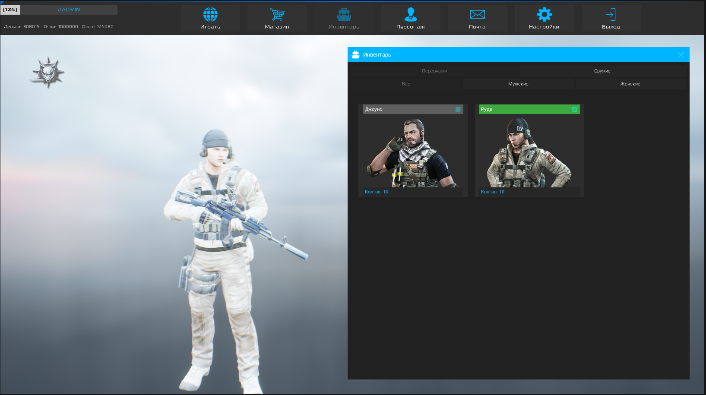

# **CYBERWAR – Developed by Shaik Mohammad Yunus**
### *This project is under development.*
## 📌 Description
CYBERWAR is a network-based 1st/3rd-person shooter built using **Unreal Engine 5**, where players engage in team-oriented combat across multiple game modes. The game features objective-based missions, PvP encounters, and **weapon customization**, providing both tactical and fast-paced gameplay.

---

## 🚀 Characteristics
- **Client:** Unreal Engine 5  
- **Server:** Java  
- **Database:** MySQL  

---

## 🛠️ Components Used

### 🔌 Plugins
1. [LE Socket Connection](https://www.unrealengine.com/marketplace/low-entry-socket-connection "Paid")  
2. [LE Extended Standard Library](https://www.unrealengine.com/marketplace/low-entry-extended-standard-library "Free")  
3. [VaRest](https://www.unrealengine.com/marketplace/varest-plugin "Free")  

### 💻 Built Using
1. IntelliJ IDEA (server)  
2. MySQL (database)  
3. Navicat (database management)  
4. Unreal Engine 5.4.3 (client)  

---

## 🖼️ Screenshots

---

✍️ **Developed by:** *Shaik Mohammad Yunus*  
